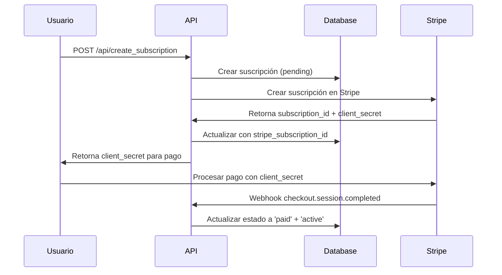
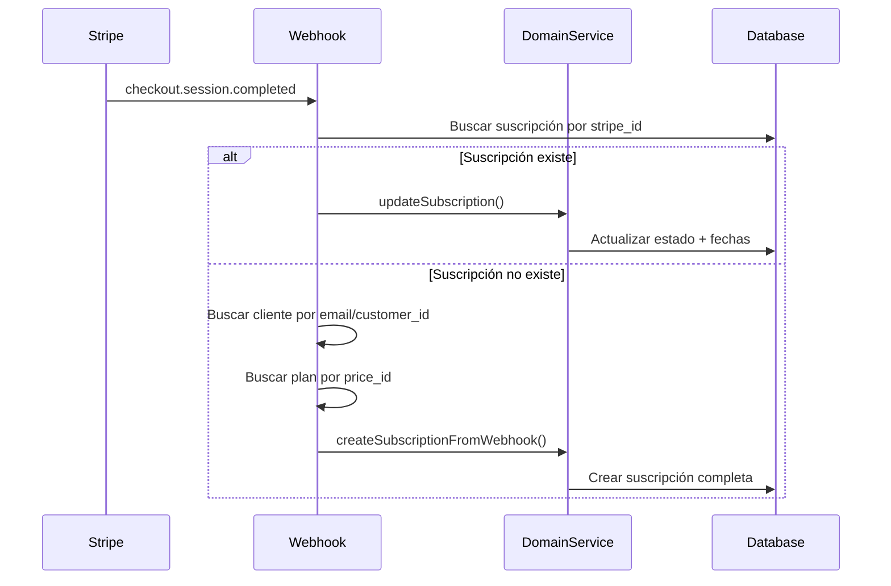

# 📋 FUNCIONAMIENTO DEL SISTEMA DE SUSCRIPCIONES

> Documentación completa del sistema de gestión de suscripciones implementado en FlexyStock.
> 
> **Fecha:** 2025-09-07  
> **Versión:** 1.0  

---

## 🎯 **RESUMEN GENERAL**

El sistema de suscripciones de FlexyStock controla el acceso de los clientes a la plataforma basándose en:
- ✅ **Estado activo** (`is_active = true`)
- ✅ **Estado de pago** (`payment_status = 'paid'`)  
- ✅ **Fechas de validez** (no expiradas)
- ✅ **Integración con Stripe** para pagos automáticos

---

## 🏗️ **ARQUITECTURA DEL SISTEMA**

### **Componentes Principales**

```
┌─────────────────────────────────────────────────────────────┐
│                    CONTROL DE ACCESO                        │
├─────────────────────────────────────────────────────────────┤
│ ClientAccessControlTrait → SubscriptionAccessVoter         │
│              ↓                                              │
│ SubscriptionWebhookService.hasActiveSubscription()         │
│              ↓                                              │
│ SubscriptionRepository.findActiveByClient()                │
├─────────────────────────────────────────────────────────────┤
│                   GESTIÓN DE DATOS                         │
├─────────────────────────────────────────────────────────────┤
│ SubscriptionDomainService (Servicio Central)               │
│              ↓                                              │
│ CreateSubscriptionUseCase & SubscriptionWebhookService     │
│              ↓                                              │
│ SubscriptionRepository                                      │
└─────────────────────────────────────────────────────────────┘
```

---

## 🔒 **CONTROL DE ACCESO**

### **1. ClientAccessControlTrait**

**Ubicación:** `src/Security/ClientAccessControlTrait.php`

**Propósito:** Verificar que un cliente tenga suscripción activa antes de permitir acceso.

#### **Métodos Disponibles:**

```php
// Retorna JsonResponse si hay error, null si acceso permitido
protected function verifyClientAccess(Client $client): ?JsonResponse

// Lanza excepción si acceso denegado
protected function requireClientAccess(Client $client): void
```

#### **Uso en Controladores:**
```php
class CreateProductController extends AbstractController
{
    use ClientAccessControlTrait;

    public function __invoke(Request $request): JsonResponse
    {
        // Obtener cliente actual
        $user = $this->getUser();
        $client = $user->getClients()->first();

        // Verificar acceso
        $accessCheck = $this->verifyClientAccess($client);
        if ($accessCheck) {
            return $accessCheck; // 402 Payment Required
        }

        // Continuar con lógica normal...
    }
}
```

### **2. SubscriptionAccessVoter**

**Ubicación:** `src/Security/SubscriptionAccessVoter.php`

**Propósito:** Integración con el sistema de seguridad de Symfony.

#### **Funcionamiento:**
```php
// En controlador
$this->isGranted('ACCESS_CLIENT', $client) // → true/false

// Internamente llama a:
SubscriptionWebhookService->hasActiveSubscription($client->getUuidClient())
```

### **3. Verificación de Suscripciones Activas**

**Método:** `SubscriptionRepository->findActiveByClient()`

**Criterios para considerar una suscripción activa:**
```sql
SELECT * FROM subscription 
WHERE client = :client 
  AND is_active = true 
  AND payment_status = 'paid'
  AND (ended_at IS NULL OR ended_at > NOW())
ORDER BY created_at DESC
```

---

## 🎛️ **GESTIÓN DE SUSCRIPCIONES**

### **1. Servicio de Dominio Central**

**Ubicación:** `src/Subscription/Application/Services/SubscriptionDomainService.php`

**Propósito:** Punto único para creación y actualización de suscripciones.

#### **Métodos Principales:**

```php
// Crear suscripción (uso general)
public function createSubscription(
    Client $client,
    SubscriptionPlan $plan,
    ?\DateTimeInterface $startedAt = null,
    ?\DateTimeInterface $endedAt = null,
    ?string $stripeSubscriptionId = null,
    ?string $uuidUserCreation = null,
    string $context = 'general'
): Subscription

// Crear desde webhook (método específico)
public function createSubscriptionFromWebhook(
    Client $client,
    SubscriptionPlan $plan,
    string $stripeSubscriptionId,
    ?\DateTimeInterface $startedAt = null,
    ?\DateTimeInterface $endedAt = null
): Subscription

// Actualizar suscripción existente
public function updateSubscription(
    Subscription $subscription,
    ?string $uuidUserModification = null,
    string $context = 'general'
): Subscription
```

### **2. Flujos de Creación**

#### **A) Creación Manual (API/UI):**
```
CreateSubscriptionController → CreateSubscriptionUseCase → 
SubscriptionDomainService.createSubscription() → 
PaymentGateway.createStripeSubscription() →
SubscriptionDomainService.updateSubscription() (con Stripe ID)
```

#### **B) Creación desde Webhook:**
```
Stripe Webhook → SubscriptionWebhookService.handleCheckoutCompleted() →
SubscriptionDomainService.createSubscriptionFromWebhook()
```

### **3. Gestión de Estados**

#### **Estados de Pago:**
- `pending` - Suscripción creada, esperando pago
- `paid` - Suscripción pagada y activa
- `cancelled` - Suscripción cancelada

#### **Campos de Auditoría Automáticos:**
- `created_at` - Fecha de creación
- `updated_at` - Última actualización (siempre se actualiza)
- `uuid_user_creation` - Usuario que creó la suscripción
- `uuid_user_modification` - Usuario que modificó la suscripción

---

## 🌐 **ENDPOINTS DISPONIBLES**

### **1. Crear Suscripción**

```http
POST /api/create_subscription
Authorization: Bearer {token}
Content-Type: application/json

{
    "uuidClient": "client-uuid",
    "planId": 1,
    "startedAt": "2025-09-07T00:00:00Z",
    "endedAt": null
}
```

**Respuesta:**
```json
{
    "status": "success",
    "subscription": {
        "uuid": "subscription-uuid",
        "stripe_subscription_id": "sub_stripe123",
        "client_secret": "pi_client_secret_key"
    }
}
```

### **2. Verificar Estado de Suscripción** ⭐

```http
GET /api/subscription/status?client_uuid={uuid}
Authorization: Bearer {token}
```

**Respuesta para Cliente:**
```json
{
    "status": "success",
    "data": {
        "client_uuid": "client-uuid",
        "has_active_subscription": true,
        "active_subscriptions_count": 1,
        "active_subscriptions": [
            {
                "subscription_uuid": "sub-uuid",
                "payment_status": "paid",
                "started_at": "2025-09-07 10:00:00",
                "ended_at": null,
                "plan_name": "Plan Premium",
                "stripe_subscription_id": "sub_stripe123"
            }
        ]
    }
}
```

**Verificar Suscripción Específica:**
```http
GET /api/subscription/status?subscription_uuid={uuid}
Authorization: Bearer {token}
```

**Respuesta:**
```json
{
    "status": "success",
    "data": {
        "subscription_uuid": "sub-uuid",
        "client_uuid": "client-uuid",
        "is_active": true,
        "payment_status": "paid",
        "started_at": "2025-09-07 10:00:00",
        "ended_at": null,
        "plan_name": "Plan Premium",
        "stripe_subscription_id": "sub_stripe123"
    }
}
```

### **3. Obtener Información de Suscripciones**

```http
GET /api/subscriptions?uuid={subscription-uuid}
Authorization: Bearer {token}
```

### **4. Webhook de Stripe**

```http
POST /stripe/webhook
Stripe-Signature: stripe_signature_header
Content-Type: application/json

# Eventos manejados:
# - checkout.session.completed
# - customer.subscription.deleted
```

---

## 🔄 **FLUJO DE INTEGRACIÓN CON STRIPE**

### **1. Proceso de Suscripción Manual**



### **2. Proceso de Webhook**



---

## 🛠️ **IMPLEMENTACIÓN EN CONTROLADORES**

### **Controladores que USAN ClientAccessControlTrait:**

1. `CreateProductController`
2. `UpdateProductController`
3. `DeleteProductController`
4. `GetProductController`
5. `GetAllScalesController`
6. `UpdateScaleController`
7. `DeleteScaleController`
8. `GetProductWeightSummaryController`

### **Patrón de Implementación:**

```php
class MiControlador extends AbstractController
{
    use ClientAccessControlTrait;

    public function __invoke(Request $request): JsonResponse
    {
        try {
            // 1. Verificar permisos (si aplica)
            $permissionCheck = $this->checkPermissionJson('permission.name');
            if ($permissionCheck) return $permissionCheck;

            // 2. Obtener cliente
            $user = $this->getUser();
            if (!$user instanceof User) {
                return new JsonResponse(['error' => 'Usuario no válido'], 401);
            }
            $client = $user->getClients()->first();

            // 3. Verificar acceso a suscripción
            $accessCheck = $this->verifyClientAccess($client);
            if ($accessCheck) return $accessCheck; // 402 Payment Required

            // 4. Lógica normal del controlador...

        } catch (\Throwable $e) {
            // Manejo de errores...
        }
    }
}
```

---

## 📊 **LOGS Y MONITORIZACIÓN**

### **Contextos de Logging:**

- `'usecase'` - Creación manual vía API
- `'webhook'` - Creación/actualización desde Stripe
- `'stripe_integration'` - Actualización tras crear en Stripe
- `'webhook_update'` - Actualizaciones de estado desde webhooks
- `'webhook_cancellation'` - Cancelaciones desde Stripe

### **Ejemplo de Log:**
```
[2025-09-07T17:10:40.857231+02:00] app.INFO: [SubscriptionDomainService.php:75] Subscription created via domain service {"subscription_uuid":"123","client_uuid":"456","plan_id":1,"stripe_subscription_id":"sub_123","context":"webhook"}
```

---

## ⚠️ **CÓDIGOS DE ERROR IMPORTANTES**

| Código | Significado | Acción |
|--------|-------------|---------|
| `402` | Payment Required | Cliente sin suscripción activa |
| `404` | Not Found | Cliente/Suscripción no encontrada |
| `400` | Bad Request | Parámetros faltantes |
| `455` | Permission Denied | Sin permisos para la acción |
| `500` | Internal Error | Error del servidor |

### **Respuesta de Acceso Denegado:**
```json
{
    "status": "error",
    "message": "CLIENT_SUBSCRIPTION_INACTIVE",
    "details": "El cliente no tiene una suscripción activa"
}
```

---

## 🔧 **CONFIGURACIÓN Y DEPENDENCIAS**

### **Variables de Entorno Requeridas:**
```env
STRIPE_WEBHOOK_SECRET=whsec_...
# Otras configuraciones de Stripe en PaymentGatewayService
```

### **Servicios Autowired:**
- `SubscriptionDomainService` - Servicio de dominio central
- `SubscriptionWebhookService` - Manejo de webhooks
- `SubscriptionAccessVoter` - Control de acceso
- `CheckSubscriptionStatusUseCase` - Verificación de estado

---

## 🎯 **CASOS DE USO COMUNES**

### **1. Frontend - Verificar antes de acción:**
```javascript
// Verificar estado antes de mostrar funcionalidad
const response = await fetch('/api/subscription/status?client_uuid=' + clientId);
const data = await response.json();

if (!data.data.has_active_subscription) {
    // Mostrar mensaje de suscripción requerida
    showSubscriptionRequired();
} else {
    // Permitir acceso a funcionalidad
    enableFeature();
}
```

### **2. Backend - Control en controlador:**
```php
// Verificación automática en cualquier controlador
$accessCheck = $this->verifyClientAccess($client);
if ($accessCheck) {
    return $accessCheck; // 402 - Suscripción requerida
}
```

### **3. Debugging - Verificar por qué falla acceso:**
```bash
# Ver estado detallado de cliente
GET /api/subscription/status?client_uuid=123-456-789

# Ver logs de suscripciones
docker exec docker-symfony-be tail -f /appdata/www/var/log/dev-$(date +%Y-%m-%d).log | grep subscription
```

---

## 📈 **PRÓXIMAS MEJORAS SUGERIDAS**

1. **Dashboard de Suscripciones:** Endpoint para admin con estadísticas
2. **Notificaciones:** Avisos antes de expiración
3. **Planes múltiples:** Soporte para múltiples planes activos
4. **API de facturación:** Integración completa con Stripe Billing
5. **Métricas:** Tracking de uso por suscripción

---

**📝 Nota:** Esta documentación refleja la implementación actual y debe actualizarse conforme evolucione el sistema.